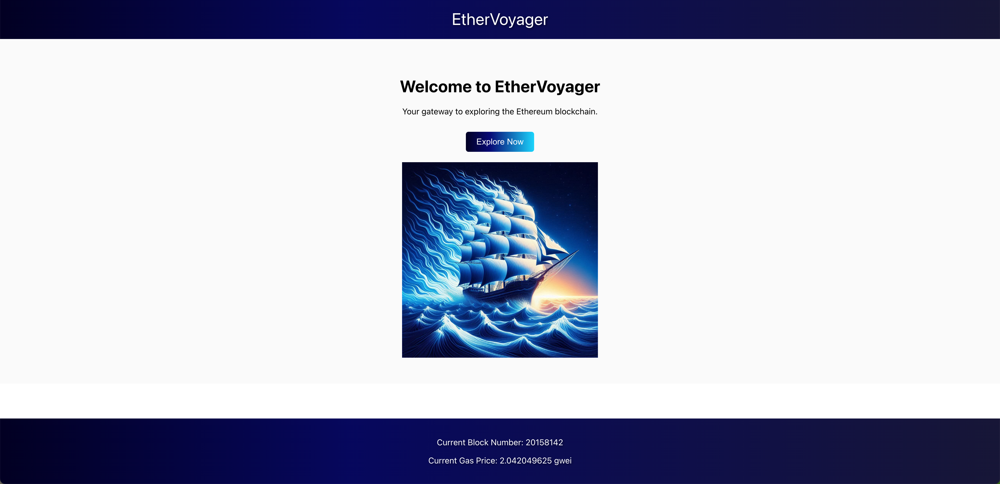

# EtherVoyager

Welcome to the EtherVoyager! EtherVoyager is a blockchain explorer tool that allows you to explore and analyze blocks, transactions, and addresses on the Ethereum blockchain.

## Features

- View detailed information about blocks, including block height, timestamp, and number of transactions.
- Explore individual transactions and view their inputs, outputs, and transaction fees.
- Search for specific addresses and view their transaction history and current balance.
- Analyze network statistics, such as total number of blocks, current fees, and transactions.

### Home View

### Search

### Transaction View

## Installation

To get started with the Block Explorer, follow these steps:

1. Clone this repository to your local machine.
2. Install the required dependencies by running `npm install`.
3. Configure the connection to your blockchain network in the `config.js` file.
4. Start the application by running `npm start`.
5. Access the Block Explorer in your web browser at `http://localhost:3000`.

## License

This project is licensed under the [MIT License](LICENSE).
